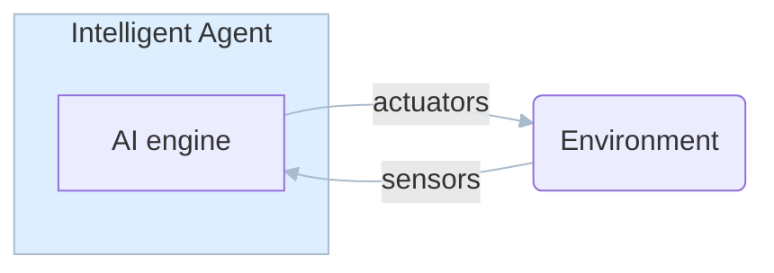

<!-- TOC -->

- [L1](#l1)
    - [Intelligent Agents](#intelligent-agents)
    - [Key Terminology](#key-terminology)
        - [Fully vs Partially Observable](#fully-vs-partially-observable)
        - [Discrete vs Continuous](#discrete-vs-continuous)
        - [Deterministic vs Stochastic](#deterministic-vs-stochastic)
        - [Benign vs Adversarial](#benign-vs-adversarial)

<!-- /TOC -->

# L1

## Intelligent Agents

## Key Terminology  
### Fully vs Partially Observable  
**Fully observable** means all elements of the environment are known by the intelligent agent at any point in time to make the optimal decision about what to do next, such as in the game of chess.  
**Partially observable** means some elements of the environment are hidden, such as in a game of poker (the agent cannot see the other person's hands) and the robot car scenario (the agent cannot know the speed of other drivers at a point in time - it needs to keep memory from previous moments to ascertain this)  
### Discrete vs Continuous  
**Discrete** means there are a finite number of choices that the agent can make, such as in chess.  
**Continuous** means there are an infinite number of choices, such as in darts, since there are infinitely many ways to angle and accelerate the throw.  
### Deterministic vs Stochastic  
**Deterministic** means your agents actions uniquely determine the outcome, such as in chess.  
**Stochastic** means there is an element of randomness that affects the environment, such as in backgammon (because a dice must be rolled), or in the robot car (because the environment can change randomly)  
### Benign vs Adversarial  
**Benign** means that there is no other entity in the environment that is playing against your agent.  
**Adversarial** means that something is 'out to get you,' which makes the optimal decision much more difficult.

